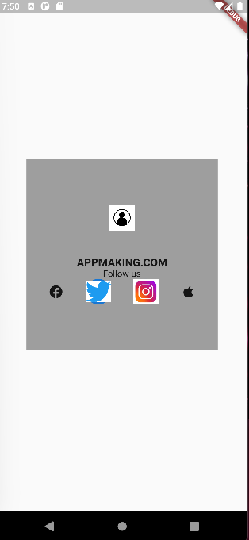

git branch 13_avatar_rows_icons && git checkout 13_avatar_rows_icons && git add . && git commit -m "13_avatar_rows_icons" && git push --set-upstream origin 13_avatar_rows_icons

# act1_screens_carapia

# Task 13

## Screenshot

