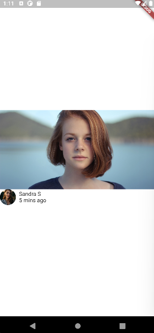

git branch 17_social_post_media_2 && git checkout 17_social_post_media_2 && git add . && git commit -m "17_social_post_media_2" && git push --set-upstream origin 17_social_post_media_2

# act1_screens_carapia

# Task 17

## Screenshot

