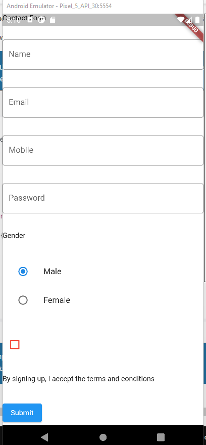

git branch 19_textfield_radio_check && git checkout 19_textfield_radio_check && git add . && git commit -m "19_textfield_radio_check" && git push --set-upstream origin 19_textfield_radio_check

# act1_screens_carapia

# Task 19

## Screenshot

